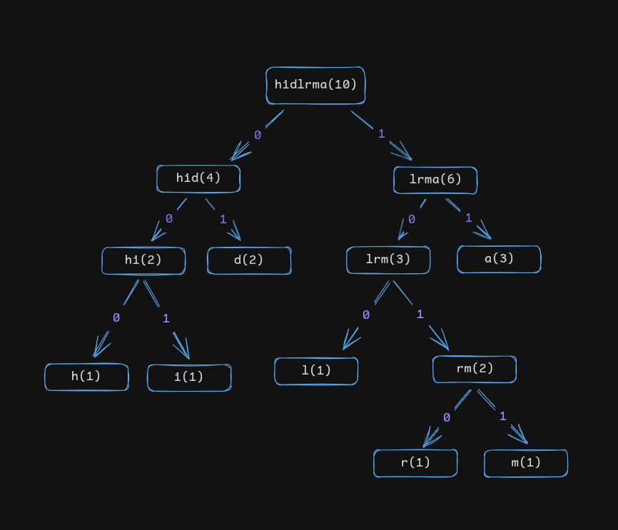

### Compression Tool 🗜️

A compression tool is a piece of software that is used to store a file data in a compressed format. It is useful for space optimization i.e it helps to store the same amount of information using less memory space. In this application Huffman coding algorithm is used to compress the file content.

### Huffman Encoding Algorithm 🚀

The main steps of the algorithm are explained below -

1. **Frequency Count**: First and most important step of this algorithm is to count the frequency of each character present in the source file.
2. **Build Huffman Tree**: Next step is to build a Huffman tree based on the frequency table.
3. **Encode Tree**: We assign the left edge a value of `0` and right `1` for each node from root node till we reach a child node. After this process we can obtain the encoded bit string for each character. Since characters are present in the child node only, the route from root to a particular child node is the encoded bit string for that particular character.

**Let's understand the Algorithm with the help of an example** 🧠

1. Suppose the file content is `halamadrid`
2. The frequency table would look like this.

   | Character | Frequency |
   | --------- | --------- |
   | `h`       | 1         |
   | `a`       | 3         |
   | `l`       | 1         |
   | `m`       | 1         |
   | `d`       | 2         |
   | `r`       | 1         |
   | `i`       | 1         |

3. The Huffman Tree (🌲) for the corresponding table would be



- The following steps are used to build the Huffman Tree from the frequency table 🪜
  1. Initially insert all nodes into a `priority queue`.
  2. A node have to have at least two fields
     - `characters` - representing the characters the node holds.
     - `frequency count` - frequency count of the chracters.
  3. Select two characters with least frequencies, remove those two nodes from the list, add their frequency and insert the newly created node into the list.
  4. Step (iii) is repeated until the list contains only one character.
- Once the `Huffman Tree` is built, not its time to prepare the tree for encoding. For each **non-terminal** node, assign the left child edge a value of `0` and right child edge a value of `1`.

4. After the tree is build and edges are assigned values, the bit encoding of a character is equal to the path from root node to a child node. The encodings(🪢) are shown below -

   | Character | Encoding |
   | --------- | -------- |
   | `h`       | 000      |
   | `a`       | 11       |
   | `l`       | 100      |
   | `m`       | 1011     |
   | `d`       | 01       |
   | `r`       | 1010     |
   | `i`       | 001      |

5. So, the encoded bit sequence for `halamadrid` will be
   `000111001110111101101000101`

### Store the encodings to a file

Since we can't open a lock without it's key 🔑, here also if we only store the encoded bit sequence to a file, we wont be able to decode the file content later. To be able to decode the content we should either have access to the **frequency table** or the **character encodings table** directly. To store this indirect information, we could insert a header section in our target file, which will hold this importalt information. Obviously, the file size will increase depending on the size of the table compared to only storing the encoded bit sequence, but these are very much importalt to retrieve the original information.
<br/>
Here are some variables that i used to identify Header section in my application.
```go
var (
	HeaderBodySeparator   string = "\n~<=>-\n"
	KeyValuePairSeparator string = "%->"
	KeyValueSeparator     string = "-<>~"
)
```
<br/>

And the **compressed file** file content for the text `halamadrid` is

```
000-<>~h%->001-<>~i%->01-<>~d%->100-<>~l%->1010-<>~r%->1011-<>~m%->11-<>~a
~<=>-
ïh
```
Where `ïh` is the actual encoded content.

### Decoding the compressed file 🔐
To decode the compressed file content, we would first need to parse the header part to retrieve the **character encodings table**. In the above example the header part contains 
```
000-<>~h%->001-<>~i%->01-<>~d%->100-<>~l%->1010-<>~r%->1011-<>~m%->11-<>~a
```
In which each **key-value** pair is separated by `%->`. Now if we store the **k-v pairs** in an array, the array would look like
```
[
    000-<>~h,
    001-<>~i,
    01-<>~d, 
    100-<>~l,
    1010-<>~r, 
    1011-<>~m,
    11-<>~a
]
```
Now using the **key-value separator** i.e. `-<>~`, we can build the **character encodings table** as following.

   | Character | Encoding |
   | --------- | -------- |
   | `h`       | 000      |
   | `a`       | 11       |
   | `l`       | 100      |
   | `m`       | 1011     |
   | `d`       | 01       |
   | `r`       | 1010     |
   | `i`       | 001      |

<br/>
Since, we have now access to both the encoded bit sequence and the character encodings table, we can now easily retrieve the original file content.

### Application Specific Details 📃

- First build the application by running `make`.
- Run the application using `./gc` or by running `go run main.go` directly.

### Output


<br/>
<br/>

In the above picture, it can be seen that the compressed file `gc_comp.txt`
occupies less memory than the source file `gc_source.txt`.
